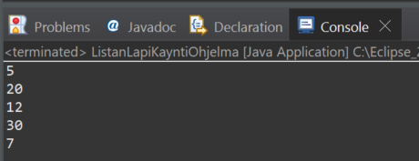

# Esimerkki 1:
Tässä esimerkissä luodaan Java -luokka, jossa lisätään ArrayList tietorakenteeseen kokonaisnumerot: 5, 20,12, 30, 7.

Tämä jälkeen tulostus suoritetaan .forEach -metodia käyttäen siten, että tälle metodille annettu lambda lause suoritetaan listan jokaiselle numerolle.

Tässä esimerkissä tulostus tehdään konsoli-ikkunaan.

Esimerkkikoodi on:
<code>
package lista;

import java.util.ArrayList;

public class ListanLapiKayntiOhjelma {

	public static void main(String[] args) {
		ArrayList<Integer> pisteet = new ArrayList<Integer>();
		
		pisteet.add(5);
		pisteet.add(20);
		pisteet.add(12);
		pisteet.add(30);
		pisteet.add(7);
		
		pisteet.forEach( (n) -> { System.out.println(n); });

	}

}
</code>

 
Esimerkkiajo. 

[Ohjelmakoodi löytyy myös GitHub:ista osoittesta: ](https://github.com/sauli-isonikkila/Ohjelmointi2/tree/6a6311173360e019f17bfcce5d9821b4a3d2a971/Lambda/Esimerkki_01 )
