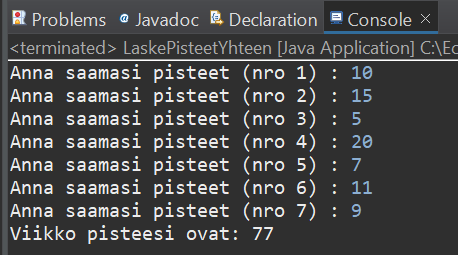

# Tehtävä 1:
Tee Java LaskePisteetYhteen -luokka, jonka avulla pystyy laskemaan viikon aikana saamansa päivittäiset pisteet main -metodissa. Pisteet annetaan konsoli-ikkunassa. 

Suorita pisteiden yhteenlaskenta Lambda -funktiota käyttäen. Tulostus yhteenlasketuista pisteistä tulostetaan konsoli-ikkunaan. 

Käytä summan laskemiseen Summa -nimistä luokka. Tulosta sinne kertynyt tulos main -metodissa lopuksi konsoli-ikkunaan.

 
Esimerkkiajo.

Tee ratkaisustasi zip -paketti ja palauta se vastauksenasi palautuslinkkiin Moodleen.