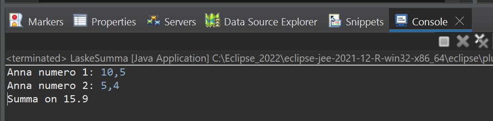

# Tehtävä 2:
Tee Java rajapinta eli interface (ICalculate), jossa saa olla Lambda funktioiden yhteydessä vain täsmälleen yksi metodi. Esimerkiksi: 

double execute(double n1, double n2); 

kahden desimaaliluvun yhteenlaskemiseksi. 

Luo LaskeSumma Java luokka ja siihen main -metodi, jossa pystytään kysymään käyttäjältä kaksi desimaalinumeroa. Määritä tämän jälkeen Lambda lause, jossa on kaksi parametria (esim. n1 ja m2). Laske näiden parametrien arvot yhteen tässä Lambda lauseessa. Tarvitset tässä ensin luomaasi ICalculate rajapintaa toteuttaaksesi rajapinnassa olevan execute metodin:

IAddable sum =  (n1, n2) -> (  n1 + n2 );

ja 

Vähennyslaskun laskemiseksi:

IAddable vahennysLasku =  (n1, n2) -> (  n1 - n2 );

Tulosta yhteenlaskun tulos konsoli-ikkunaan alla olevan kuvan mukaisesti.
Tulostus onnistuu lauseella:
Sytem.out.println("Summa on " + sum.execute(6,11));
ja
System.out.println("Erotus on " + vahennysLasku.execute(6,2));

 
Esimerkkiajo.

Tee ratkaisustasi zip -paketti ja palauta se vastauksenasi palautuslinkkiin Moodleen.