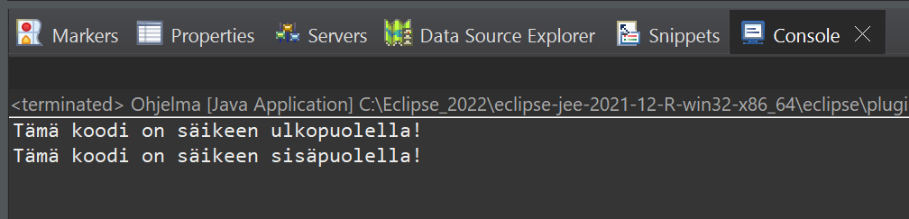

# Esimerkki 1:
Tässä esimerkissä periytetään Ohjelma -nimiseen luokaan Thread luokasta ominaisuudet Java säikeistä (Thread). 

Periytetyn Thread -luokan avulla voi luoda run() metodin Ohjelma luokkaan. Tässä run() metodissa on kaikki se ohjelma koodi, joka ajetaan Java säikessä (Thread). Esimerkiksi tulostetaan haluttu teksti konsoli-ikkunaan. Mutta ohjelma koodi voisi olla muutakin.

Nyt kun run -metodi on saatu tehty, voitaisiin se ajaa käyntiin. Se saadaan tehtyä esimerkiksi Ohjelma -luokassa, luomallaa Ohjelma luokasta (rekursiivisesti) olio. Tämän olion start -metodilla voimme käynnistää Java säikeen.

 
Esimerkkiajo.

