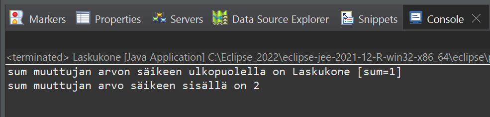

# Tehtävä 1:
Tee Java luokka, jonka nimi on Laskukone ja periytä siihen Threads luokka, jolloin voit käyttää Javan säikeitä (Thread). Luo tähän Laskukone luokkaan luokka tasolle kokonaisluku muuttuja summa. Alusta oletus muodostimessa (oletus konstruktorissa) muuttujan sum arvoksi nolla. Luo myös niin sanotut setterit ja getterit sekä toString -metodi.

 Laskukone luokasta luodaan rekursiivisesti yksi Lakukone -luokka tyyppinen olio main -metodissa. Aja tämän jälkeen säie käyntiin, eli kutsu luomasi olion start -metodia. Kasvata tämän jälkeen main -metodissa sum muuttujan avoa yhdellä ylöspäin ja tulosta saatu arvo konsoli-ikkunaan.

Thread -luokan periyttäminen LAskukone -luokkaan mahdollistaa run metodin. Tämä mahdollistaa run -metodissa Java säikeessä ajettavan ohjelmakoodin. Tee tässä siihen laskuri, joka kasvattaa sum muuttujan arvoa yhdellä (sum++) ja tulosta arvo konsoli-ikkunaan. 

 
Esimerkkiajo.

Tee ratkaisustasi zip -paketti ja palauta se vastauksenasi palautuslinkkiin Moodleen.