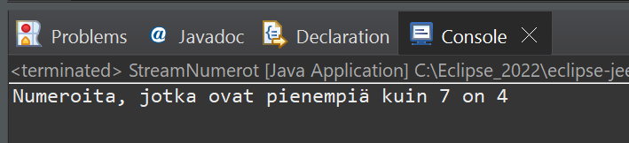

# Esimerkki 1:
Tee StreamNumerot Java luokka, jonka avulla pystyy lisäämään listaan (ArrayList) kokonaisnumerot:

4
19
2
7
5
3

Käytä tämän jälkeen ohjelmassasi Java Stream:ia löytääksesi lista tietorakenteesta numerot, jotka ovat pienempiä kuin 7. Laske samalla näiden numeroiden lukumäärä.

Tulosta lopuksi saamasi tulos konsoli-ikkunaan.

 
Esimerkkiajo.

Tee ratkaisustasi zip -paketti ja palauta se vastauksenasi palautuslinkkiin Moodleen.