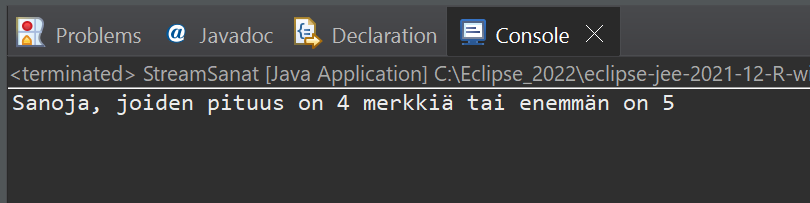

# Tehtävä 1:
Tee StreamSanat Java luokka, jonka avulla pystyy lisäämään listaan (ArrayList) viisi sana.

Käytä tämän jälkeen ohjelmassasi Java Stream:ia löytääksesi lista tietorakenteesta sanat, joissa merkkejä on 4 merkkiä tai enemmän. Laske samalla näiden sanojen lukumäärä.

Tulosta lopuksi saamasi tulos konsoli-ikkunaan.

 
Esimerkkiajo.

Tee ratkaisustasi zip -paketti ja palauta se vastauksenasi palautuslinkkiin Moodleen.