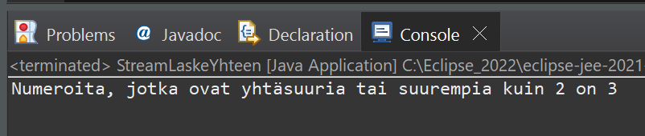

# Tehtävä 2:
Tee StreamLaskeYhteen Java luokka, jonka avulla pystyy lisäämään listaan (ArrayList) desimaalinumerot:

2.5
6
4.25
10
1.25

Käytä tämän jälkeen ohjelmassasi Java Stream:ia löytääksesi lista tietorakenteesta numerot, jotka ovat suurempia tai yhtäsuuria kuin 2. Laske samalla näiden numeroiden lukumäärä.

Tulosta lopuksi saamasi tulos konsoli-ikkunaan.

 
Esimerkkiajo.

Tee ratkaisustasi zip -paketti ja palauta se vastauksenasi palautuslinkkiin Moodleen.